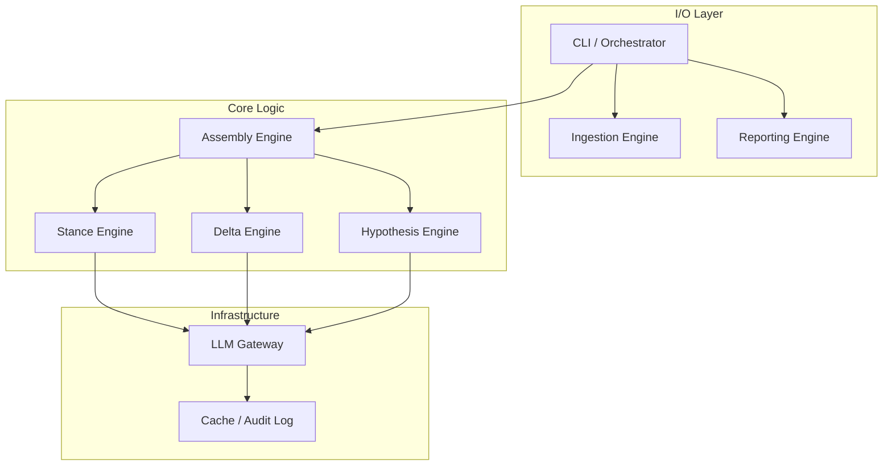
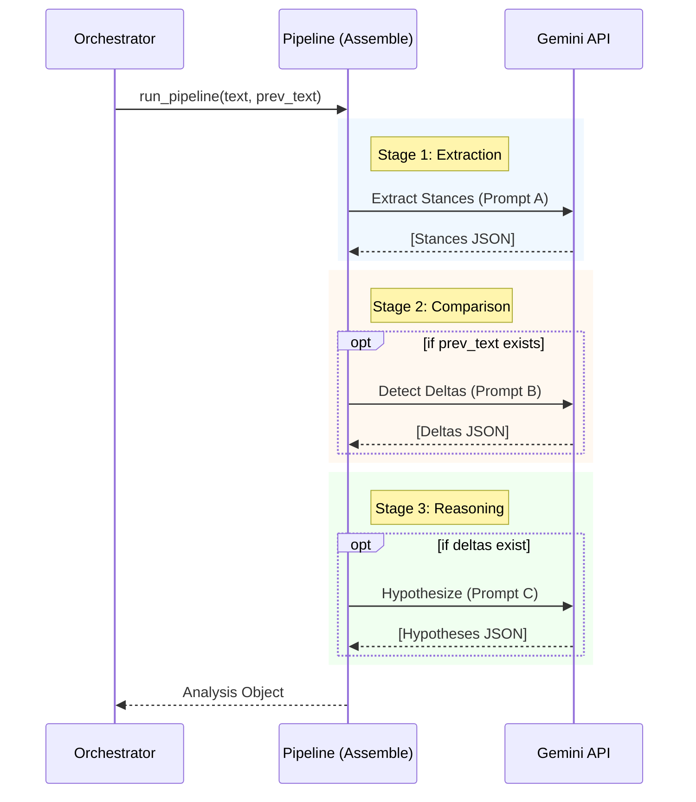

# Sahasranshu System Architecture

> **Abstract**: Sahasranshu is a stateless, manifest-driven policy analysis pipeline designed to quantifiably track regulatory stance shifts over time. It leverages a multi-stage LLM architecture to extract, compare, and hypothesize causal mechanisms behind policy deltas.

## 1. Design Philosophy

The system adheres to three core architectural principles:

-   **Manifest-Driven Execution**: All processing is keyed off immutable JSON manifests (`Manifest`), ensuring that every analysis run is fully reproducible and traceable to a specific source artifact.
-   **Stateless Processing**: The analysis pipeline (`engines/assemble.py`) is functionally pure where possible. It accepts `(current_text, previous_text)` and returns a structured `Analysis` object without side effects. Persistence is handled by the orchestration layer.
-   **Delta-First Cognition**: The system is optimized for *relative* understanding. Rather than analyzing documents in isolation, it prioritizes the *vector of change* (Delta) between consecutive policy states.

## 2. Component Architecture

The codebase is organized into five distinct layers, enforcing separation of concerns.



### 2.1 Orchestration (`run_one.py`)
The orchestrator acts as the glue code. It is responsible for:
1.  **Context Resolution**: Identifying validity windows and locating the "previous" document for delta tracking.
2.  **Resource Provisioning**: Instantiating the LLM client and loading configuration.
3.  **Persistence**: Writing the final JSON analysis and Markdown memos to disk.

### 2.2 Ingestion (`ingestion/`)
Handles the normalization of unstructured inputs.
-   **PDF Processing**: Uses `pypdf` to extract text while preserving page boundaries, essential for citing evidence.
-   **Manifest Loading**: Validates input metadata against `sahasranshu.schemas`.

### 2.3 LLM Gateway (`llm/`)
A resilient interface to the model provider (Gemini).
-   **Resilience**: Implements exponential backoff and retries (default: 10 retries).
-   **Telemetry**: Maintains a rigorous audit log (`.cache/llm_audit.jsonl`) of every prompt, attempt, latency, and cost.
-   **Replayability**: Optional recording mode (`--record-llm`) captures raw responses for regression testing.

## 3. Data Flow Pipeline

The analysis pipeline executes a strictly ordered sequence of cognitive tasks.



## 4. Key Data Structures

### 4.1 The Manifest
The atomic unit of work.
```json
{
  "doc_id": "2024-12-18_FOMC_Statement",
  "publication_date": "2024-12-18",
  "file": { "relative_path": "../../pdfs/..." }
}
```

### 4.2 The Analysis Object
The final output artifact.
```json
{
  "instances": [
    { "topic": "Inflation", "stance": "Hawkish", "evidence": "..." }
  ],
  "deltas": [
    { "change_type": "Strengthened", "description": "..." }
  ],
  "hypotheses": [
    { "mechanism": "Labor market cooling", "confidence": "High" }
  ]
}
```

## 5. Extensibility

The system is designed for horizontal scaling across regulatory domains.
-   **Prompt decoupling**: Prompts are isolated in `sahasranshu.llm.prompts`, allowing domain-specific prompt engineering without code changes.
-   **Schema verification**: `sahasranshu.schemas` uses Pydantic to ensure all LLM outputs conform to the strict type contracts required by downstream consumers (UI/Dashboard).
